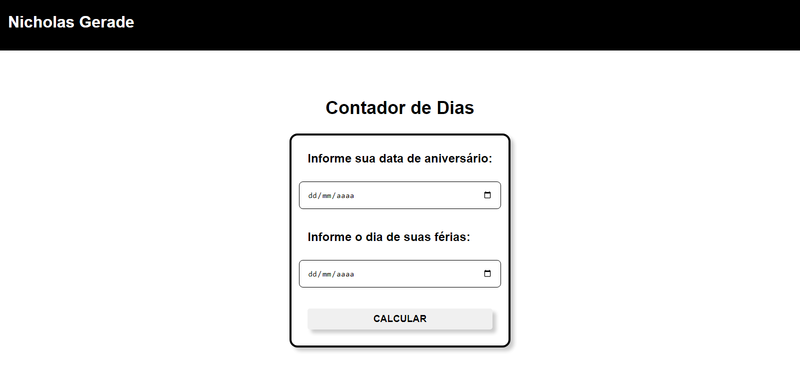

<h1 align="center"> Projeto Javascript - Niver</h1>

Projeto Javascript - Niver

---

 

  

---
## 💻 Tecnologias

Esse projeto foi desenvolvido com as seguintes tecnologias:

- HTML5
- CSS3
- Javascript
- Git e Github

---

## 🚧 Projeto

Projeto de Javascript onde o usuário entra com a data de seu Aniversário e a data de quando começará suas Férias, e o programa retorna com quantos dias faltam para ambos.
Projeto realizado durante a matéria ILP-540 pela Fatec São Paulo. Projeto 4 de 5 projetos que devem ser entregues para complementar a nota do Semestre.

Você pode ver o site nesse link: [Javascript - Niver](https://nigerade.github.io/Javascript-Niver/)

--- 
